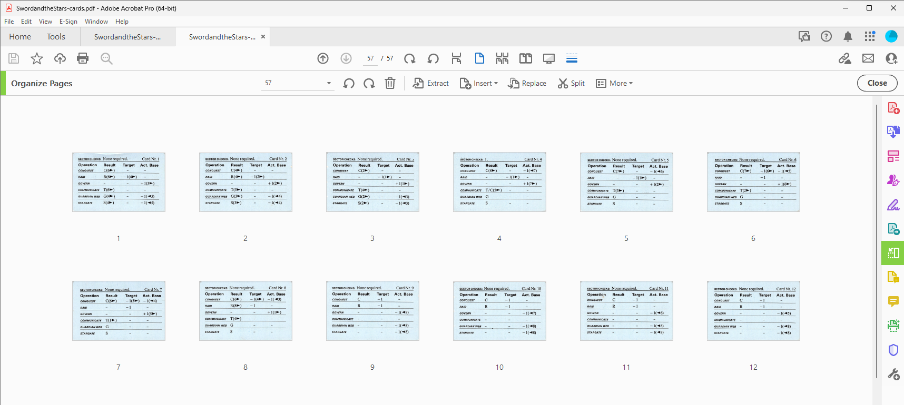
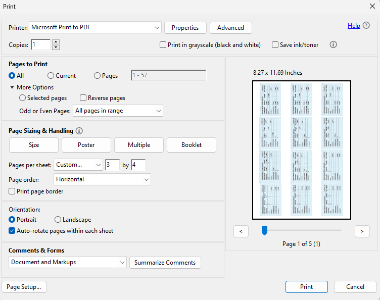

*[The Sword and the Stars]* is a 4X exploration and empire building game released by SPI in 1981 ([bgg]). A friend on [Facebook] asked for improved scans of the cards.  
At simpubs towers we are lucky to have a brilliant Fujitsu [ix500] scansnap scanner which easily scans many pages to pdf.  

All of the cards were scanned at 300ppi to pdf

Then we used the *print to pdf* to print to 4x3 on a page

[Dearflip] view


 
 


  

[ix500]: https://www.pfu.ricoh.com/global/scanners/scansnap/ix500/
[facebook]: https://www.facebook.com/groups/spigames/posts/2368822476647433/?comment_id=2368875923308755
[bgg]: https://boardgamegeek.com/boardgame/2121/sword-and-stars
[The Sword and the Stars]: https://nextcloud.simpubs.org/s/JLqwBftQGyeA5gs?
[pdf]: https://nextcloud.simpubs.org/s/JLqwBftQGyeA5gs?dir=undefined&openfile=198037
[dearflip]: https://github.com/dearhive/dearflip-jquery-flipbook