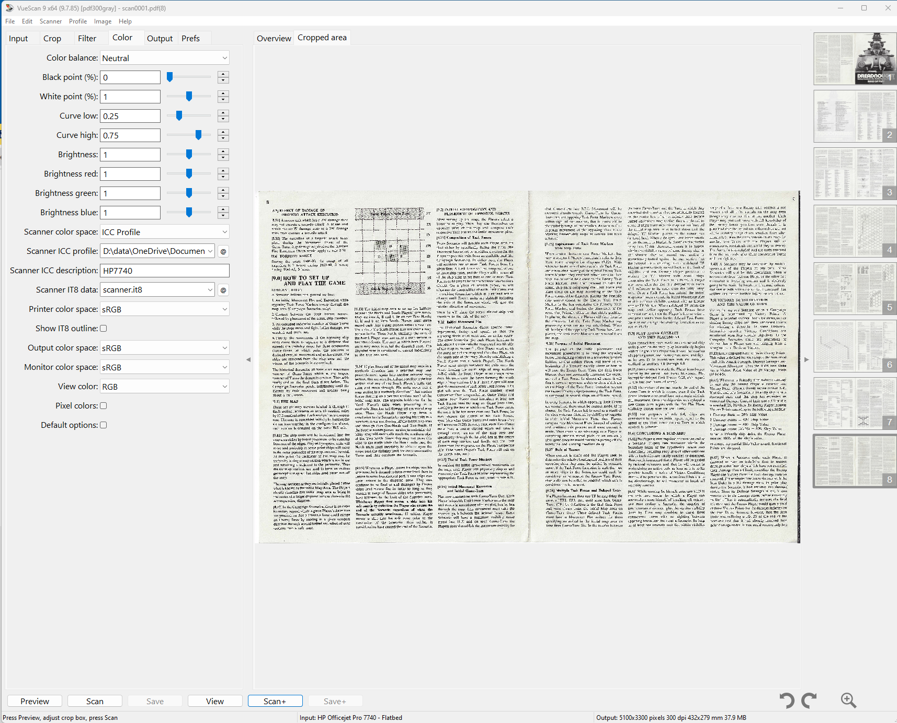

The huge team at *[simpubs]* (ie [jzedward]) spends a lot of time scanning pdfs. Sadly to get what we want, there is no single tool that does the job.  

For all of  our images, we start with [vuescan] from Hamrick. Bad news, it's expensive, but it does the best job of capture with support for an accurate [IT8] profile. We'll do another blog on setup some time. [vuescan] scans to pdf (usually 300ppi grey) or image (we use TIF @ 600ppi).  

For pdf documents (eg rules), we will usually separate and scan double pages (11x17 US size).

Often grey scans have variations of shading and *bleed*. [vuescan] can adjust brightness and contrast, but I have not found it very helpful, so I use [scanpapyrus] to crop and edit, and it's brightness/contrast can use specific values on a scale. It is a reasonable $20. My favourite is the nice simple export to pdf for a specific page size. It does page split also, but is not great at page sorting, or the **exact** size of page split.

[sejda] is an (excellent) online pdf editor, and I use it most for the page split in booklet order (ie double sided booklet to single sided). It is quick and easy, and free (up to 50 pages).

Finally, I am lucky to have a full Adobe subcription with Acrobat, which I use for OCR and page ordering and numbering. Frankly, given the cost of [acrobat] it's pretty annoying that the stuff that [scanpapyrus] and [sejda] does is not included.

There *are* free pdftools, some of which are powerful, especially if you have command line skills eh [pdftk

Honourable (UK spelling please) mention to the totally brilliant [imagemagick] which I use every day - it is **the** most powerful tool for image manipulation, and has pdf capabilities too.

Footnote, for free scanning, [naps2] is excellent, if it only had better cropping and a brightess/contrast tools it could replace [vuescan] and [scanpapyrus], if you want to make compromises, [naps2] is worth using.

[simpubs]: https://www.simpubs.org
[jzedward]: https://jzedwards.github.io
[vuescan]: https://www.hamrick.com
[IT8]: https://www.greywhitebalancecolourcard.co.uk/it8.html
[scanpapyrus]: https://www.scanpapyrus.com
[sejda]: https://www.sejda.com
[acrobat]: https://www.adobe.com/acrobat
[pdftk]: https://www.pdflabs.com/tools/pdftk-the-pdf-toolkit/
[imagemagick]: https://www.imagemagick.org
[naps2]: https://www.naps2.com